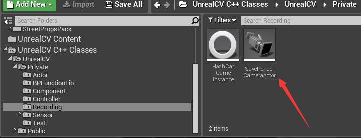
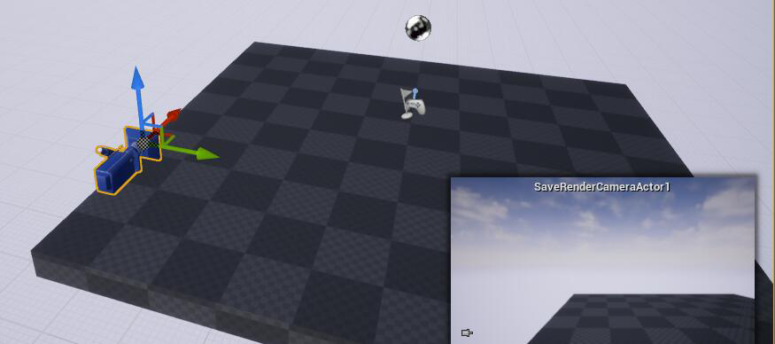
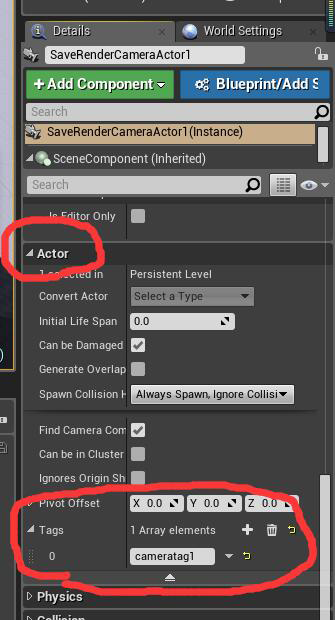
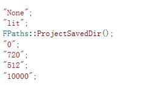

# UnrealcvNewRenderThread
Add RecordCommand

Usage：
1.Add a camera(unrealcv/private/recording/saveRenderCamera)

2.Add a actor tag to camera

3.run command

 
vset /action/rec/start cameraTag imageType filepath deltaTime width height imageNumber

7 Parameters ,you need type 1 at least[camera tag].

cameraTag                               to find target camera by tag. 

imageType                                "lit" or "depth".

filepath                                savepath endwith"/".

deltaTime                               time between two save(unit:ms).

width                                    resolution

height                                   resolution

imageNumber                             how many pics to save.

default values

eg :vset /action/rec/start cameratag1 lit F:/Myproject/Saved/ 50 1920 1080 100

vset /action/rec/stop cameraTag

1 parameter ,to stop record.
